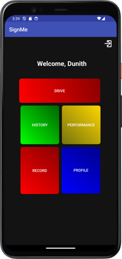
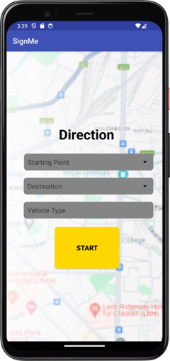

<h1 align="center">
   
  </a>
   
  InnoSys
   
</h1>

<h4 align="center">Real-time Traffic Sign Recognition System Android Application </h4>

  
  
&nbsp;

&nbsp;

    
    
    

## **🛠️ Technologies Used**

This project was built using the following technologies.

- Java
- MySQL Server Database
- Android Studio

## ** Included**

- Android Studio Project
- MySQL Server Database File
- Research Component Algorithm

## Key Features

* Mobile Application Integration: Seamlessly integrates with a mobile app for on-the-go traffic sign recognition and driver assistance.
* Research Component - Preprocessing Algorithm

## **🚀 Installation**
- Clone the repository: git clone https://github.com/lakmina456/InnoSys_Implementation_01.git

## 🤝 Contributing

Contributions are welcomed with open arms! 🙌 If you'd like to contribute to this project, 
please follow these steps:

1. Fork the repository.
2. Create a new branch (git checkout -b feature/new-feature).
3. Make your changes.
4. Commit your changes (git commit -am 'Add new feature').
5. Push to the branch (git push origin feature/new-feature).
6. Create a new Pull Request.

## **Show your support**

Hit the Star button if you like this website!

## **📝 License**
This project is licensed under the MIT License.

## **📧 Contact**
If you have any questions or suggestions, feel free to reach out.

